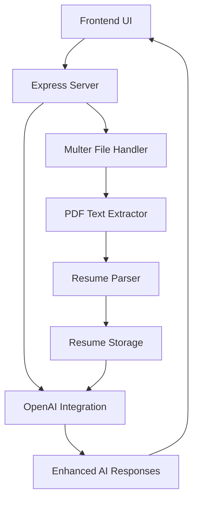

# Design Document

## Overview

The resume upload integration feature will extend the existing AI interview preparation system to accept PDF resume uploads and incorporate resume content into AI-generated interview questions and responses. The system will extract text from uploaded PDFs, parse relevant information, and use this context to provide personalized interview experiences.

The design leverages the existing Express.js server architecture, multer file handling, and OpenAI integration while adding PDF processing capabilities and enhanced AI prompt engineering.

## Architecture

### High-Level Architecture



### Component Interaction Flow

1. **Upload Flow**: User selects PDF → Frontend validates → Server receives → Multer processes → PDF extractor converts → Parser extracts key info → Storage saves
2. **Interview Flow**: User starts interview → Server retrieves resume context → OpenAI receives enhanced prompt → AI generates personalized response → Frontend displays

## Components and Interfaces

### 1. Frontend Components

#### Resume Upload Section
- **Location**: New section in the existing HTML interface
- **Components**:
  - File input with PDF validation
  - Upload progress indicator
  - Resume status display (filename, upload date)
  - Replace/delete resume options
- **Styling**: Consistent with existing glass-effect design system

#### Resume Status Indicator
- **Purpose**: Show current resume state in the status panel
- **States**: No resume, Processing, Ready, Error
- **Integration**: Extends existing status component

### 2. Backend Components

#### PDF Processing Service
```javascript
class PDFProcessor {
  async extractText(filePath)
  async validatePDF(file)
  async processPDF(filePath)
}
```

#### Resume Parser Service
```javascript
class ResumeParser {
  async parseResumeContent(text)
  extractSkills(text)
  extractExperience(text)
  extractEducation(text)
  extractProjects(text)
}
```

#### Resume Storage Service
```javascript
class ResumeStorage {
  async saveResume(userId, resumeData)
  async getResume(userId)
  async updateResume(userId, resumeData)
  async deleteResume(userId)
}
```

#### Enhanced AI Service
```javascript
class AIService {
  async generateQuestionWithResume(transcription, resumeContext)
  buildEnhancedPrompt(basePrompt, resumeContext)
  formatResumeContext(resumeData)
}
```

### 3. API Endpoints

#### Resume Upload Endpoint
- **Route**: `POST /upload-resume`
- **Purpose**: Handle PDF resume uploads
- **Request**: Multipart form data with PDF file
- **Response**: Upload status and processed resume summary

#### Resume Management Endpoints
- **Route**: `GET /resume-status` - Get current resume info
- **Route**: `DELETE /resume` - Delete uploaded resume
- **Route**: `PUT /resume` - Replace existing resume

#### Enhanced Interview Endpoint
- **Modification**: Update existing `/upload` endpoint
- **Enhancement**: Include resume context in AI prompts
- **Backward Compatibility**: Maintain functionality for users without resumes

## Data Models

### Resume Data Structure
```javascript
{
  id: String,
  filename: String,
  uploadDate: Date,
  extractedText: String,
  parsedData: {
    personalInfo: {
      name: String,
      email: String,
      phone: String
    },
    skills: [String],
    experience: [{
      company: String,
      position: String,
      duration: String,
      description: String,
      technologies: [String]
    }],
    education: [{
      institution: String,
      degree: String,
      field: String,
      year: String
    }],
    projects: [{
      name: String,
      description: String,
      technologies: [String]
    }]
  },
  summary: String
}
```

### Enhanced AI Context Structure
```javascript
{
  basePrompt: String,
  resumeContext: {
    candidateBackground: String,
    relevantSkills: [String],
    experienceLevel: String,
    focusAreas: [String]
  },
  interviewType: String
}
```

## Error Handling

### File Upload Errors
- **Invalid file type**: Clear error message with accepted formats
- **File size exceeded**: Specific size limit information
- **Upload failure**: Retry mechanism with error details
- **Corrupted PDF**: Validation error with re-upload option

### PDF Processing Errors
- **Text extraction failure**: Fallback to OCR or manual entry suggestion
- **Parsing errors**: Graceful degradation with partial information
- **Storage errors**: Temporary file cleanup and user notification

### AI Integration Errors
- **Resume context too large**: Intelligent truncation with priority preservation
- **API failures**: Fallback to generic interview mode
- **Context formatting errors**: Error logging with graceful degradation

## Testing Strategy

### Unit Tests
- **PDF Processing**: Test text extraction with various PDF formats
- **Resume Parsing**: Validate parsing accuracy with sample resumes
- **AI Prompt Enhancement**: Test context integration and prompt building
- **File Validation**: Test file type and size validation logic

### Integration Tests
- **End-to-End Upload Flow**: Complete resume upload and processing
- **AI Interview Integration**: Test enhanced AI responses with resume context
- **Error Scenarios**: Test all error handling paths
- **File Management**: Test resume replacement and deletion

### User Acceptance Tests
- **Upload Experience**: Test user interface and feedback
- **Interview Quality**: Validate personalized interview questions
- **Error Recovery**: Test user experience during error scenarios
- **Performance**: Test upload and processing speed

## Implementation Considerations

### Dependencies
- **PDF Processing**: `pdf-parse` or `pdf2pic` + OCR for complex PDFs
- **Text Processing**: Natural language processing for resume parsing
- **File Storage**: Extend existing multer configuration
- **Validation**: `joi` or similar for input validation

### Security
- **File Validation**: Strict PDF validation and virus scanning
- **Storage Security**: Secure file permissions and access controls
- **Data Privacy**: Resume data encryption and secure deletion
- **Input Sanitization**: Prevent injection attacks through resume content

### Performance
- **Async Processing**: Non-blocking PDF processing
- **Caching**: Cache parsed resume data for repeated use
- **File Size Limits**: Reasonable limits to prevent resource exhaustion
- **Cleanup**: Automated cleanup of temporary files

### Scalability
- **File Storage**: Consider cloud storage for production
- **Processing Queue**: Queue system for heavy PDF processing
- **Database**: Structured storage for resume metadata
- **Monitoring**: Logging and monitoring for upload success rates